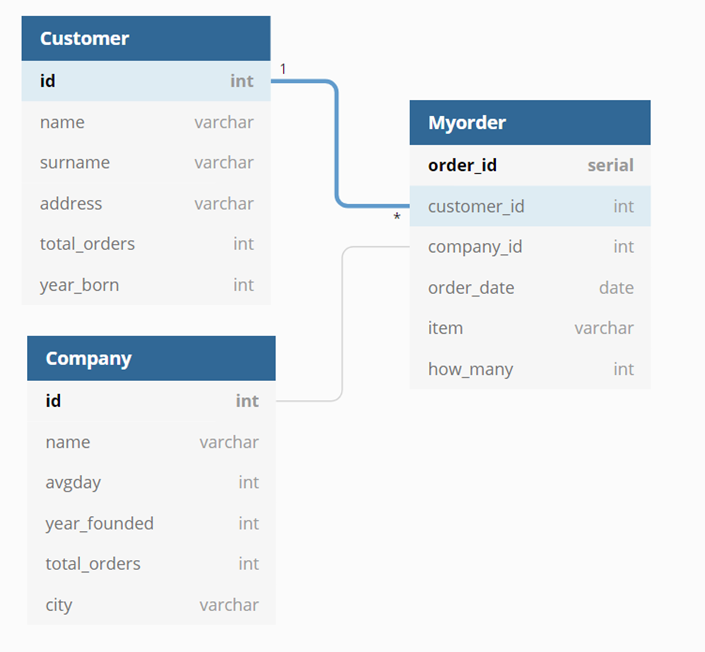

Developer Guide
===============

Database Design
---------------

**For this project I decided to implement a delivery management system. So, I needed three tables. Customer table for holding the customer data, Company table for holding company and Myorder table for holding order data.**

	Table Diagram

Code (Model-View-Template Structure)

Code
----

**explain the technical structure of your code**

**to include a code listing, use the following example**::

   .. code-block:: python

      class Foo:

         def __init__(self, x):
            self.x = x

Views
^^^^^

Views are what end-users are exposed to. It couples models and templates, renders them and serves them
to the users. These views are explained in detail on member specific implementation pages.

They are located at the folder ``routes/``

Templates
^^^^^

Templates are not changed significantly and are written in Jinja2 format.

They are located at the folder ``templates/`` and are to be used by views.

.. toctree::

   member1
