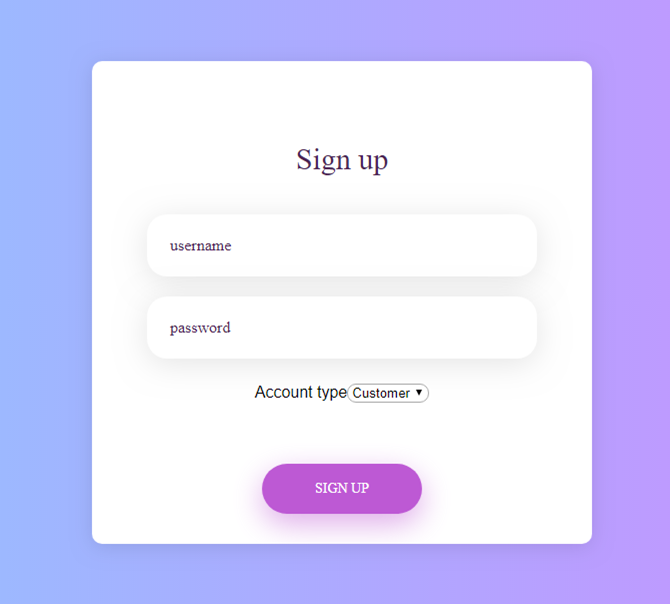
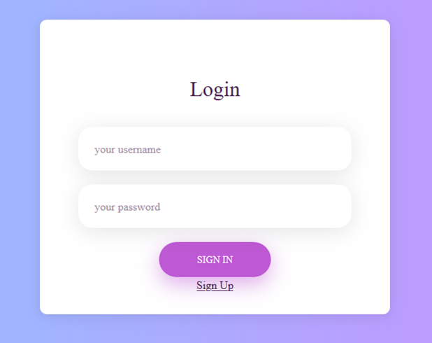
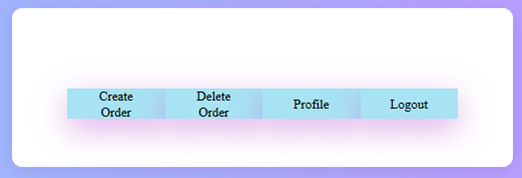
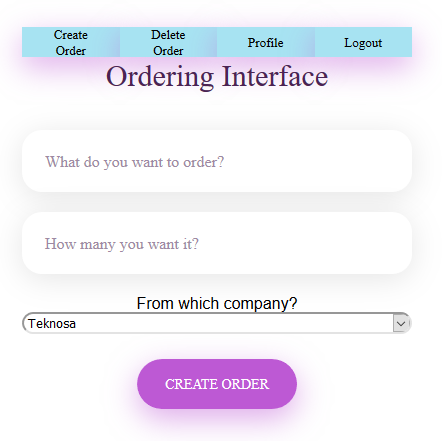
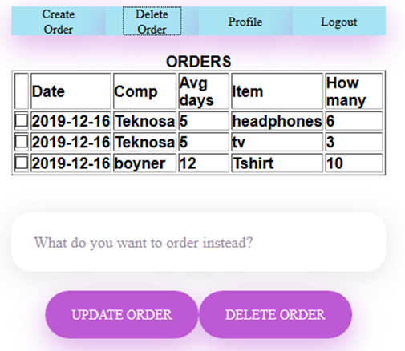
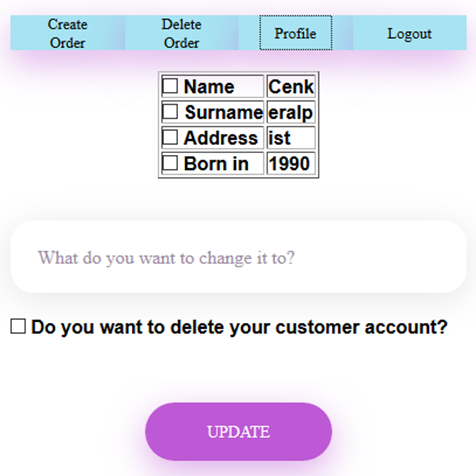

User Guide
===============

In this part of documentation the website user interfaces such as

	- Signup
	- Login
	- Customer Dashboard
	- Company Dashboard

will be discussed.

Signup
-------

This is section of my website where people can sign in to system and after logging in they can access to this websites full capabilities.

	Registration Page

You choose a username and a password. Then, you have to choose your account type whether you are a customer or a company. After that one of two different forms will pop up and you fill up and click on the signup button.

Login
-------

Here you just have to put down the username and password you choose during signup. Then, the website validates your password and if it is correct it lets you into the website. If forwards you to one of two different dashboards depending on your account type.

	Login page

Customer Dashboard
------------------

Once you logged in to the website as a customer you will see this page. It will contain 3 different subsections and 1 button for logging out.

	Customer Dashboard

Once you click on Create Order this section will appear. This is the ordering  interface. You just have to write down the item you want to order, how many of that you want and choose which company you want to receive this item from. You can finish the process by clicking the CREATE ORDER button.

	Customer Create Order

Once you click on Delete Order this section will appear. Here you can see the orders that you made with detailed information. You can check one of the orders with checkbox and then you can either update the item or delete that specific order.

	Customer Delete Order

Once you click on Profile this section will appear. Here you can see your detailed customer information. You can check one of the info with checkbox and then you can either update it with a new value. Also, you can delete your customer account.

	Customer Profile

Company Dashboard
------------------

Once you logged in to the website as a company you will see this page. It will contain 2 different subsections and 1 button for logging out.

.. figure:: images/CompanyDashboard.png
   :align:   center

	Company Dashboard

Once you click on Delete Order this section will appear. Here you can see the orders that is made from your specific company with detailed information. You can check one of the orders with checkbox and then you can delete that specific order.

	Customer Delete Order

Once you click on Profile this section will appear. Here you can see your detailed company information. You can check one of the info with checkbox and then you can either update it with a new value. Also, you can delete your company account.

	Customer Profile

   member1
   member2
   member3
   member4
   member5
   
